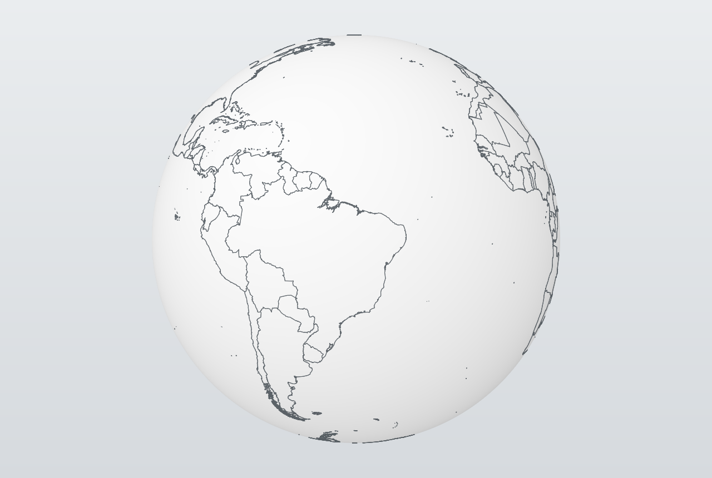
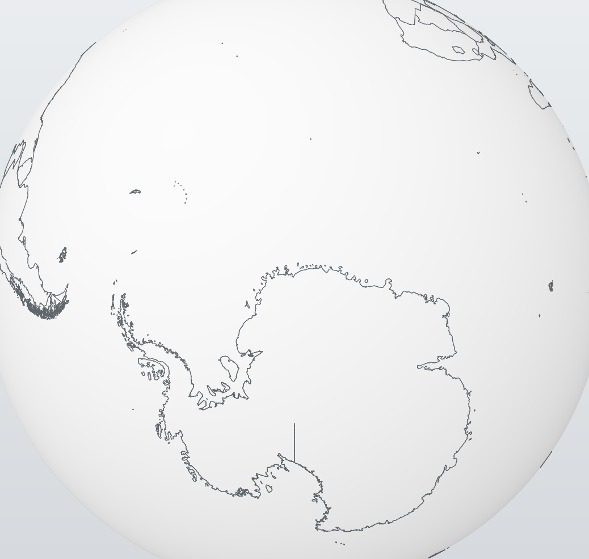
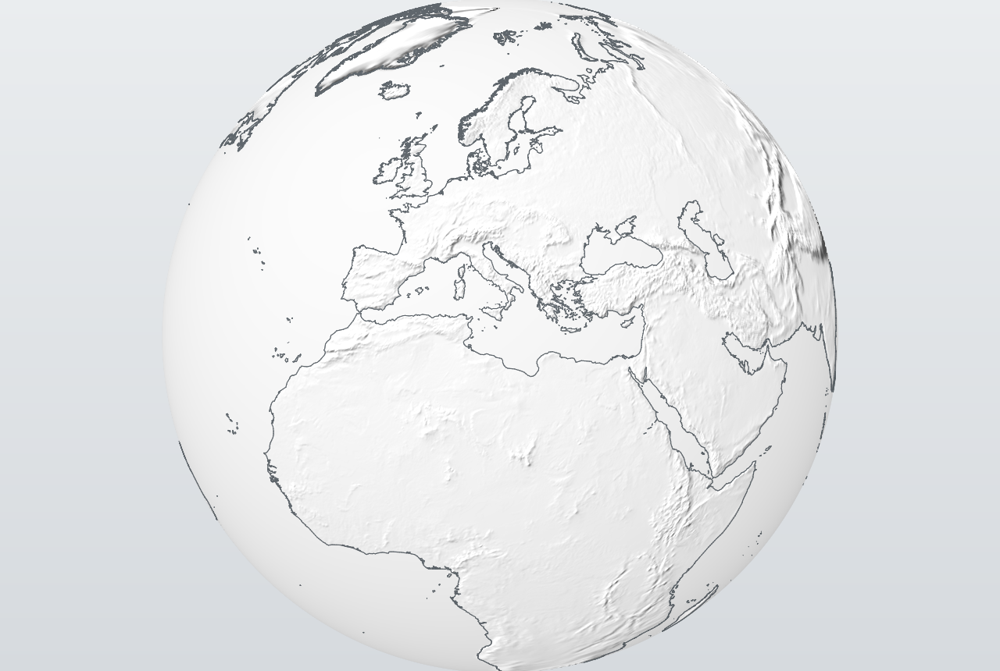
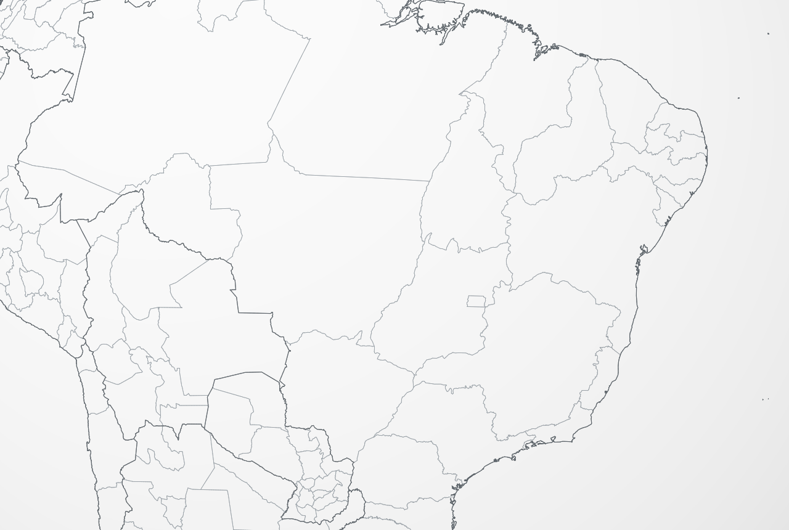
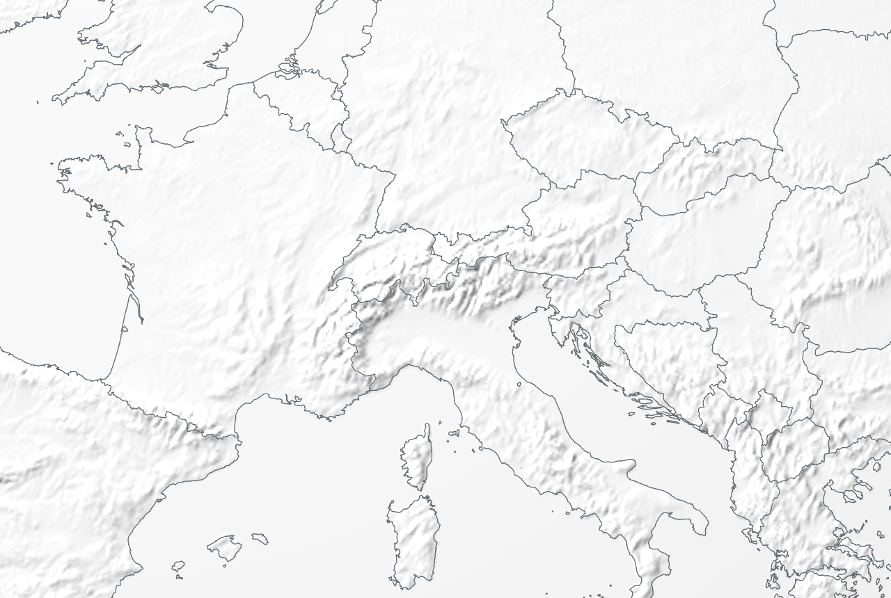
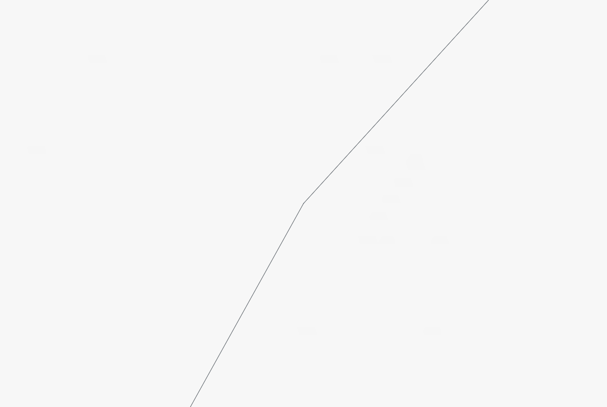
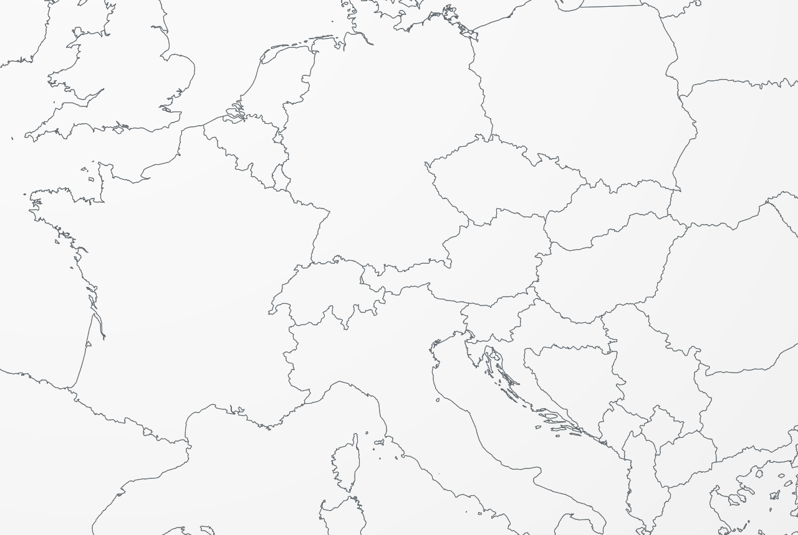

# Tactile Globe

A globe of country borders that can dress as four different maps. Scroll to
zoom, drag to spin. A style selector swaps the whole surface; buttons add a
graticule, city dots, place names and a live coordinate readout, take the
internal borders away, or add the state and province borders of every country.

A single 11.2 MB file with no external dependencies — it opens from `file://`,
by double-click, offline.



---

## Use

Open `globo.html`. That's it.

| action | result |
|---|---|
| scroll | zoom, anchored on the point under the cursor |
| drag | spins the globe, the grabbed point stays under the cursor |
| `style` selector (or `s` to cycle) | plain, sepia, atlas or satellite |
| `grid` button (or `g`) | parallels and meridians every 15°, plus the tropics and polar circles |
| `lon / lat` button (or `p`) | reads out the coordinates under the cursor |
| `cities` button (or `c`) | city dots, more of them the closer you get |
| `labels` button (or `l`) | country and city names |
| `relief` button (or the `r` key) | shades the continents by elevation |
| `land borders` button (or the `b` key) | hides the internal borders, keeping the coastline |
| `states & provinces` button (or the `d` key) | toggles the subdivisions; brings the land borders back with them |

Zoom runs from the whole globe small on screen down to ~13 m of altitude.

---

## The problem

The brief had one requirement that decides everything else: **resolution**, for
both very deep and very distant zoom on the same object. That rules out the two
obvious approaches.

- **Texture on a sphere** — fixed resolution. An 8K texture gives ~2.5 km per
  pixel at the equator; anything closer is a blur.
- **Tessellated mesh** — the silhouette becomes a polygon. On a 10k-face sphere
  the horizon already shows facets at moderate zoom.

So: **vector** borders and an **analytic** sphere.

---

## The data

Source: [Natural Earth](https://www.naturalearthdata.com/) 1:10m,
`admin_0_countries` — the most detailed public country-outline dataset. 13 MB of
GeoJSON, 548,471 points.

`tools/build.mjs` reduces that to 2.38 MB:

**1. Quantization** to 1e-6 degree (~11 cm). The real cartographic accuracy of
the source is on the order of 1 km, so this is 10,000× finer than the data —
nothing is lost.

**2. Deduplicating shared borders.** In the GeoJSON, the Brazil–Paraguay border
exists twice, once in each country's polygon. Drawing both thickens the line and
doubles the cost. With vertices already quantized, shared segments are
bit-for-bit identical, so an undirected key (`A→B` and `B→A` are the same
segment) in a `Set` is enough. **68,617 duplicate segments** removed — 12.6% of
the total, which is exactly the share of land border versus coastline.

**3. Removing artificial edges.** Two kinds exist only because GeoJSON is flat
and a globe is not:

- The Antarctica polygon covers the south pole. In lon/lat that is impossible
  without a fake edge running down the antimeridian to latitude −90.
- Polygons crossing the antimeridian (Russia, Fiji) are cut there, and the cut
  becomes a vertical edge at ±180°.

That is **777 segments** that do not exist on a sphere. Without the filter, a
straight line runs from the Antarctic coast toward the pole — visible below
centre here:



**4. Re-chaining.** The surviving segments are regrouped into chains by walking
the original ring and cutting where a segment was dropped — same result as
building the full topology, without indexing vertices. Storing chains instead of
loose segments halves the point count.

**5. Zigzag varints** over consecutive deltas. Since neighbouring points are
close, deltas almost always fit in 1–2 bytes: **5.21 bytes per point**.

> I tried gzip on top: only 11% smaller. The varint stream is already near
> entropy, and it was not worth a `DecompressionStream` dependency. Plain base64
> it is.

Result: 479,106 points and 474,782 unique segments.

### Splitting coastline from land border

The occurrence count above is not thrown away after deduplication, because it
already says which is which:

> a segment carried by **two** country polygons is a border between them; one
> carried by a single polygon is coast

So the layer splits, exactly and for free, into **406,165** coastline segments
(4,264 chains, 2.04 MB) and **68,482** land border segments (233 chains,
0.34 MB). That is what the `land borders` button switches off, leaving the
continents' outline standing:



Carrying the country code alongside the tally buys one more thing. Natural
Earth keeps Western Sahara as its own admin_0, and drawn that way it is a lone
box outlined in the middle of the desert — which reads as a defect rather than
as a position on a disputed territory. A `MERGE` table renames it to Morocco
before the tally, so the 135 segments they share end up carried twice by what
is now one country: neither coastline nor border between two, so they are
dropped outright. The pair is bounded by the Atlantic, Algeria and Mauritania,
the way most modern maps draw it. Whatever `MERGE` drops is also withheld from
the subdivision layer, or the outline would simply move down a level.

### The second layer: states and provinces

This comes from Natural Earth's `admin_1_states_provinces` — 4,596 subdivisions
across 253 countries, 1.3 million points.

The catch is that those polygons **also** contain the coastline and the national
borders: every coastal state carries its slice of coast. Drawing the whole set on
top of the first layer would double every country outline.

The way out depends on a fact worth verifying before committing to it: both
datasets are built on the **same topology**. Measured with quantized vertices,
**99.6% of admin_0 segments appear bit-for-bit identical in admin_1**. That
allows subtraction by exact key — no tolerance, no proximity heuristic:

| admin_1 segments | |
|---|---|
| already in the country layer | 540,864 → dropped |
| duplicated between neighbouring states | 371,157 → dropped |
| artificial (pole, antimeridian) | 775 → dropped |
| **internal borders remaining** | **373,827** |

What is left is 5,967 chains and 379,794 points — 1.78 MB. That is the layer the
button toggles, drawn in a lighter grey and thinner than the country layer so the
hierarchy stays readable: a national border outweighs a state border.



### Relief

Elevation is the one thing here that cannot be a vector. It comes from NASA's
GEBCO-derived raster, 21600x10800 8-bit greyscale, box-averaged down 4x to
5400x2700 — about 7.4 km per pixel at the equator.

That source has a convenient encoding: 0 is sea level *and everything below it*.
The ocean is therefore already flat, no land mask is needed, and 67% of the image
is a single constant — which is why the result is 1.60 MB rather than the several
megabytes a full-range DEM of that size would cost. It is written back out as a
greyscale PNG, so the browser decodes it natively and no JavaScript decoder ships.

Shading happens in the sphere's fragment shader, which already has the surface
normal — and the raster is equirectangular, so the normal *is* the lookup. Four
taps give the gradient, the local normal is tilted by it, and a fixed north-west
light does the rest. Cost: **0.01-0.04 ms per frame**.

Two details matter more than they look:

- **The mip level is chosen and fetched explicitly.** Letting the hardware pick
  it would collapse two neighbouring taps onto the same texel under minification,
  and the relief would fade out exactly when the whole globe is in view. The
  sampling offset and the level are derived together from the on-screen texel
  footprint, with the longitude derivative unwrapped so the antimeridian does not
  read as an infinite gradient.
- **It fades out below roughly 8x magnification.** Past that it is blur
  pretending to be terrain, while the vector lines beside it stay sharp. Relief
  is a continental-scale statement here; it is not there to be zoomed into.

Because the filled region runs through the same sphere shader, it picks up the
relief for free — the Alps and the Pyrenees read straight through the navy.



### Places, and the names on them

258 country label points and 7,342 cities, out of Natural Earth's
`populated_places` — 18 MB of source, almost all of it names in dozens of
languages. Only the point, the rank and one name survive: **125 KB**.

Both sets are stored **in order of importance**, and that is what makes the
zoom threshold free. Showing everything down to rank k is drawing the first
`cum[k]` entries, so it stays one draw call with a smaller count and needs no
per-instance test. 27 cities on the whole globe, 2,445 at 300 km.

The names are **DOM over the canvas**, not a glyph atlas in WebGL. The browser
already hints and kerns text; the hard part was never drawing the letters, it
is choosing which names fit. Each frame the candidates are culled by the same
exact horizon test the geometry uses, projected in double precision, sorted by
rank, and placed greedily against the boxes already taken — first come, first
served, capped at 90. Country names get a bias so a capital beats a small
country and a small country beats a small town.

### Styles

Four surfaces, and three of them cost nothing to ship. Sepia and atlas are
**functions of the elevation raster that was already in the file** — a colour
ramp and a hillshade, evaluated in the sphere's fragment shader. No new
download, no new bytes, and no measurable frame time: every style lands in the
same 0.1–0.44 ms band as the plain globe.

- **plain** — the white cartographic globe the project started as.
- **sepia** — tan paper, the relief doing all the work. The grain is applied in
  *screen* space, not on the sphere, because paper sits in front of a map
  rather than on the terrain: it must not zoom with it.
- **atlas** — the hypsometric ramp of a physical atlas. Land elevation is
  heavily skewed low, so the input is shaped (`pow(e, 0.42)`) before the ramp,
  or every continent lands on the first colour.
- **satellite** — NASA Blue Marble, 5400x2700, the one style that needs its own
  raster (2.45 MB).

Because the ramp reads elevation, the atlas style colours Ireland and the
Amazon the same: distinguishing forest from grassland needs land cover, which
is a different dataset.

### Reconstruction, and what it can and cannot fix

The satellite style is a whole-globe texture: at 7.42 km per pixel it is at
native resolution only when the globe is small on screen, and magnifies from
there — about 615,000x at maximum zoom, where the entire screen fits inside one
texel.

Hardware bilinear is what makes an enlarged image look like tiles. Its
reconstruction is a tent, so the first derivative jumps at every texel edge and
the eye reads those creases as blocks. **Catmull-Rom in nine bilinear taps** is
C1 across the edge, so the seams disappear at any zoom, for 0.05 ms — and it is
applied only under magnification, since a cubic on minification is the wrong
filter anyway.

That fixes *pixelation* completely and *detail* not at all. Past roughly 30x the
image is smooth colour with nothing in it, and the vector coastline beside it
stays exact, which advertises the blur rather than hiding it. Whether the
imagery should fade out where it stops having anything to say is still open.

### The graticule

The only layer with no source at all: parallels and meridians every 15°,
generated as chains and handed to the same pipeline as the borders, which
gives it levels of detail and view culling for nothing. The tropics and the
polar circles are a second layer, a shade darker.

Two details it needed. A `minStep` per layer, because the sagitta
densification the borders use would subdivide a grid line to 450,000 segments
for a shape that is exact at 60,000. And parallels are cut into quadrants:
simplification flattens a constant-latitude line to its two endpoints, and a
chain spanning the full 360° then unwraps across the antimeridian to a span of
zero — the whole circle collapsing to one degenerate segment. No quadrant can
wrap.

---

## The rendering

Two WebGL2 passes, no depth buffer.

### Pass 1 — the sphere, by analytic intersection

A full-screen triangle; every pixel solves the ray–sphere intersection in closed
form. There is no mesh, so **there is no faceting at any zoom** and the
silhouette is exact. Edge antialiasing falls out of the discriminant via
screen-space derivatives.

The naive form `t = b − √(b²−c)` cancels catastrophically when the camera is
grazing the surface (`b ≈ √(b²−c)`). The rationalized version
`t = c/(b + √(b²−c))` is stable across the whole range, with `c = 2h + h²`
computed in double on the CPU.

### Pass 2 — the lines, instanced

One quad per segment, expanded in screen space for constant pixel width.

**Horizon occlusion without a depth buffer.** A point `G` on the unit sphere is
visible from camera `C` iff `dot(G, C) ≥ 1`. Since every line lies exactly on the
sphere, that test is exact — and it removes for free the z-fighting that drawing
lines coplanar with a surface would cause. The test runs per fragment (soft
cutoff at the horizon) and also per vertex, discarding whole segments on the far
side early.

### The precision problem

`float32` has ~7 digits. On a unit-radius sphere that is an ulp of ~6e-8. By the
time the camera drops to 600 m of altitude the screen covers ~1e-4 in radius
units and the error is already 0.3 px; at 60 m the image visibly shakes.

The fix is emulated double arithmetic, only where it matters. Each position
reaches the GPU in two halves:

```js
hi = Math.fround(v);
lo = Math.fround(v - hi);   // residue, computed in double
```

and the shader does the eye-relative subtraction before anything else:

```glsl
vec3 rel = (aHi - uCamHi) + (aLo - uCamLo);
```

`aHi - uCamHi` is exact when the two are close (Sterbenz lemma), and the `lo`
term returns the remainder. The final error lands around 1e-13 — irrelevant even
at maximum zoom.

Verified by centring on a real vertex of the dataset at 12.7 m of altitude
(screen covering ~10 m): the line passes exactly through the centre, no shake.



Each segment's end point is stored as a **delta** rather than an absolute
position. The delta is small (≤ 0.02°), so `float32` alone already gives 1e-11 of
precision on it — 25% off the buffer at no cost.

### The curvature problem

A straight segment in lon/lat is **not** straight on a sphere. Drawing the 3D
chord between two distant vertices sinks the line into the globe. Every segment
is subdivided until the sagitta drops below 10 cm (a 0.02° step).

Interpolation is linear in lon/lat, not along a great circle — that is what
preserves borders defined by a parallel, like the 49th between the US and Canada,
which a great circle would bow northward.

### Levels of detail

Five levels, simplified with Douglas–Peucker at load time and chosen by angular
resolution per pixel. Without this, the globe seen from far away turns into a
dark smear of overlapping lines.

| level | tolerance | step | coastlines | land borders | subdivisions |
|---|---|---|---|---|---|
| 0 | — (full) | 0.02° | 799,957 | 140,942 | 642,121 |
| 1 | 0.008° | 0.06° | 280,826 | 47,374 | 194,809 |
| 2 | 0.04° | 0.25° | 72,112 | 11,810 | 51,858 |
| 3 | 0.15° | 0.90° | 20,313 | 3,320 | 16,895 |
| 4 | 0.45° | 2.50° | 8,376 | 1,201 | 8,628 |

Only level 3 of the country layer is built before the first frame. The rest
builds in the background, interleaving the two layers, so the button never opens
onto an empty globe.

Both layers go through the same shader in two draw calls — subdivisions first,
countries on top, so the heavier line wins wherever the two nearly touch.



### View culling

The horizon test hides far-side lines, but it does not make them free: every
instance still runs its vertex shader. At maximum zoom that meant 1.58 million
instances processed to show a handful of visible ones.

So segments are bucketed into a 4° lon/lat grid and the instance buffer is laid
out **in cell order**, band-major. Each cell carries a bounding cap (centre
direction plus angular radius, sampled along its boundary). Per frame:

1. Compute one cap containing everything on screen, by intersecting the screen
   corners and edge midpoints with the sphere, clamped to the horizon.
2. Reject cells whose cap misses that cap — a dot product against a precomputed
   `cos`/`sin` pair.
3. Because the layout is cell-ordered, the surviving cells collapse into a few
   contiguous ranges. Gaps under 1024 instances are bridged rather than split.

WebGL2 has no `baseInstance`, so each range is drawn by re-pointing the three
instance attributes at its byte offset — three `vertexAttribPointer` calls plus a
draw. When the visible cap grows past ~0.55 rad the whole thing is skipped and
the buffer is drawn in one call, since there would be nothing to cull.

At maximum zoom this draws **2,364 instances instead of 1,584,000**:

| view | before | after |
|---|---|---|
| max zoom (13 m) | 4.11 ms | 0.11 ms |
| region (127 km) | 4.16 ms | 0.10 ms |
| Europe | 1.48 ms | 0.34 ms |
| continent | 1.44 ms | 0.25 ms |
| whole globe | 0.46 ms | 0.46 ms |

Culling is **pixel-exact**: rendering with and without it and comparing the
framebuffers across 20 view/layer combinations — including both poles, the
antimeridian, the limb and maximum zoom — gives zero differing pixels out of
1.1 million each.

### Camera

State in double precision on the CPU: `lon`, `lat`, altitude. North always up.

Dragging and zooming use the same primitive: **place a world point `G` at a pixel
`(x,y)`**. That is 2 constraints, and a north-up camera has exactly 2 degrees of
freedom, so there is a closed-form solution.

Converting the pixel to a vector `g = (a,b,c)` in camera coordinates, the world's
vertical component depends on latitude alone:

```
G_y = b·cos(φ) + c·sin(φ)
```

which solves directly for `φ`; longitude comes out of a 2×2 system in the `x,z`
components.

The first version was iterative: rotate the camera by the minimal rotation that
takes the point where it belongs, re-derive north, repeat. It works, but it
converges by approximation — each step discards roll and reintroduces error — and
there is no way to claim it closes exactly. The closed form solves in one pass
and is exact by construction: **0 m error** in every case measured, including 40
scroll notches from the whole globe down to maximum zoom, and point-to-point
dragging.

---

## Performance

Measured on an RTX 3050 Laptop at 1280×860, best of 5 runs of 30 frames:

| view | countries | + subdivisions | penalty | instances drawn |
|---|---|---|---|---|
| max zoom (13 m) | 0.09 ms | 0.11 ms | 0.02 ms | 2,364 |
| region (127 km) | 0.08 ms | 0.10 ms | 0.02 ms | 1,398 |
| continent | 0.18 ms | 0.25 ms | 0.07 ms | 40,904 |
| Europe | 0.20 ms | 0.34 ms | 0.14 ms | 75,506 |
| whole globe | 0.30 ms | 0.46 ms | 0.16 ms | 135,770 |
| far out | 0.10 ms | 0.13 ms | 0.04 ms | 18,173 |
| north pole | 1.15 ms | 1.70 ms | 0.55 ms | 523,008 |

First paint at ~196 ms. 79 MB of VRAM for both layers across all levels
(2.3 million segments).

The north pole view is the remaining worst case, and it is inherent: at that
altitude the visible cap fills the screen, so there is nothing to cull and the
whole level has to be drawn. 1.7 ms is still ~590 fps.

Rendering is on demand — with no input, no frame is drawn.

---

## Reproduce

```bash
node tools/build.mjs     # fetches Natural Earth -> data/*.bin
node tools/relief.mjs    # fetches elevation -> data/relief.png
node tools/places.mjs    # countries + cities -> data/places.bin
node tools/satellite.mjs # Blue Marble -> data/satellite.jpg
node tools/pack.mjs      # src/template.html + data -> globo.html
```

Node only, no dependencies — `relief.mjs` carries its own PNG reader and writer
over the zlib that ships with Node. All three builders are deterministic: they
produce byte-identical output on every run.

```
src/template.html        renderer (WebGL2 + controls), with the data placeholders
tools/build.mjs          Natural Earth -> quantized binaries
tools/relief.mjs         global elevation -> downsampled greyscale PNG
tools/places.mjs         label points and cities -> name + rank + position
tools/satellite.mjs      Blue Marble, downloaded and embedded as published
tools/pack.mjs           packs everything into one HTML file
data/coastlines.bin      coastlines (2.04 MB)
data/land_borders.bin    country-to-country land borders (0.34 MB)
data/subdivisions.bin    internal state/province borders (1.78 MB)
data/relief.png          elevation, 5400x2700 greyscale (1.60 MB)
data/places.bin          258 countries and 7,342 cities (0.12 MB)
data/satellite.jpg       Blue Marble, 5400x2700 (2.45 MB)
globo.html               the result
```

---

## Limitations

- The **cartographic** accuracy of Natural Earth 1:10m is ~1 km. Below roughly
  2 km of altitude the zoom stays sharp but stops revealing anything new — you
  are looking at the geometry of the data, not more detail of the world.
- Coastlines are drawn. There is no coloured or shaded ocean — land and sea are
  the same white — but the coastal outline is part of each country's shape;
  without it only the loose land borders would remain.
- `admin_1` coverage varies a lot by country: some have detailed subdivisions,
  others have few or none. What shows up is what the dataset carries.
- No inertia, no spin animation, no labels.
- Requires WebGL2 (universal in current browsers; the page says so if it is
  missing).

---

## Credits

Borders: [Natural Earth](https://www.naturalearthdata.com/), public domain.
