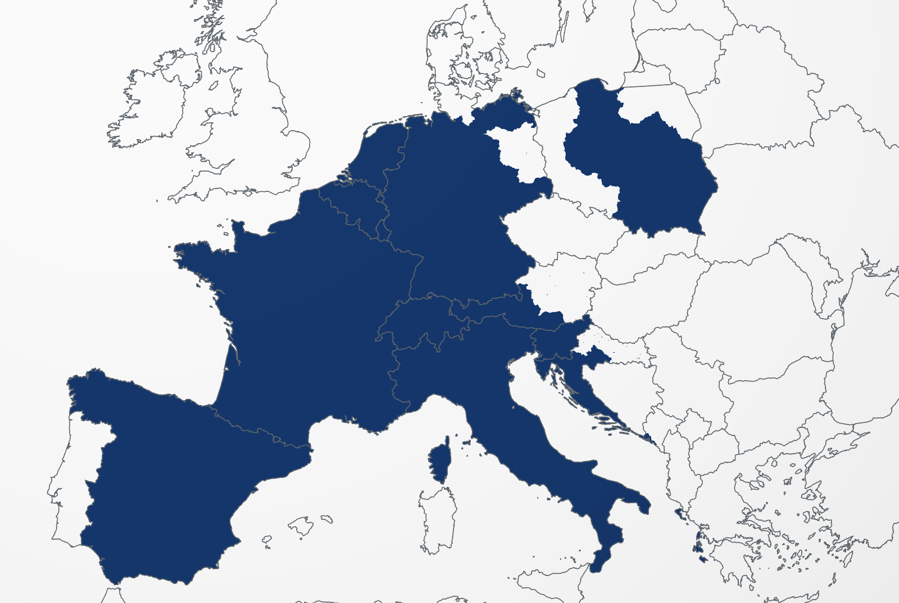

# Tactile Globe

A white globe with country borders in grey. No oceans, no labels.
Scroll to zoom, drag to spin. Buttons add continental relief, take the internal
borders away, add the state and province borders of every country, or fill the
Napoleonic Empire at its height in navy.

A single 8.0 MB file with no external dependencies — it opens from `file://`,
by double-click, offline.


---

## Use

Open `globo.html`. That's it.

| action | result |
|---|---|
| scroll | zoom, anchored on the point under the cursor |
| drag | spins the globe, the grabbed point stays under the cursor |
| `relief` button (or the `r` key) | shades the continents by elevation |
| `land borders` button (or the `b` key) | hides the internal borders, keeping the coastline |
| `states & provinces` button (or the `d` key) | toggles the subdivisions |
| `napoleonic empire` button (or the `n` key) | toggles the filled region |

Zoom runs from the whole globe small on screen down to ~13 m of altitude.

---

## The problem

The brief had one requirement that decides everything else: **resolution**, for
both very deep and very distant zoom on the same object. That rules out the two
obvious approaches.

- **Texture on a sphere** — fixed resolution. An 8K texture gives ~2.5 km per
  pixel at the equator; anything closer is a blur.
- **Tessellated mesh** — the silhouette becomes a polygon. On a 10k-face sphere
  the horizon already shows facets at moderate zoom.

So: **vector** borders and an **analytic** sphere.

---

## The data

Source: [Natural Earth](https://www.naturalearthdata.com/) 1:10m,
`admin_0_countries` — the most detailed public country-outline dataset. 13 MB of
GeoJSON, 548,471 points.

`tools/build.mjs` reduces that to 2.38 MB:

**1. Quantization** to 1e-6 degree (~11 cm). The real cartographic accuracy of
the source is on the order of 1 km, so this is 10,000× finer than the data —
nothing is lost.

**2. Deduplicating shared borders.** In the GeoJSON, the Brazil–Paraguay border
exists twice, once in each country's polygon. Drawing both thickens the line and
doubles the cost. With vertices already quantized, shared segments are
bit-for-bit identical, so an undirected key (`A→B` and `B→A` are the same
segment) in a `Set` is enough. **68,617 duplicate segments** removed — 12.6% of
the total, which is exactly the share of land border versus coastline.

**3. Removing artificial edges.** Two kinds exist only because GeoJSON is flat
and a globe is not:

- The Antarctica polygon covers the south pole. In lon/lat that is impossible
  without a fake edge running down the antimeridian to latitude −90.
- Polygons crossing the antimeridian (Russia, Fiji) are cut there, and the cut
  becomes a vertical edge at ±180°.

That is **777 segments** that do not exist on a sphere. Without the filter, a
straight line runs from the Antarctic coast toward the pole — visible below
centre here:


**4. Re-chaining.** The surviving segments are regrouped into chains by walking
the original ring and cutting where a segment was dropped — same result as
building the full topology, without indexing vertices. Storing chains instead of
loose segments halves the point count.

**5. Zigzag varints** over consecutive deltas. Since neighbouring points are
close, deltas almost always fit in 1–2 bytes: **5.21 bytes per point**.

> I tried gzip on top: only 11% smaller. The varint stream is already near
> entropy, and it was not worth a `DecompressionStream` dependency. Plain base64
> it is.

Result: 479,106 points and 474,782 unique segments.

### Splitting coastline from land border

The occurrence count above is not thrown away after deduplication, because it
already says which is which:

> a segment carried by **two** country polygons is a border between them; one
> carried by a single polygon is coast

So the layer splits, exactly and for free, into **406,165** coastline segments
(4,264 chains, 2.04 MB) and **68,617** land border segments (234 chains,
0.34 MB) — and the two add back to the 474,782. That is what the `land borders`
button switches off, leaving the continents' outline standing:


### The second layer: states and provinces

This comes from Natural Earth's `admin_1_states_provinces` — 4,596 subdivisions
across 253 countries, 1.3 million points.

The catch is that those polygons **also** contain the coastline and the national
borders: every coastal state carries its slice of coast. Drawing the whole set on
top of the first layer would double every country outline.

The way out depends on a fact worth verifying before committing to it: both
datasets are built on the **same topology**. Measured with quantized vertices,
**99.6% of admin_0 segments appear bit-for-bit identical in admin_1**. That
allows subtraction by exact key — no tolerance, no proximity heuristic:

| admin_1 segments | |
|---|---|
| already in the country layer | 540,864 → dropped |
| duplicated between neighbouring states | 371,157 → dropped |
| artificial (pole, antimeridian) | 775 → dropped |
| **internal borders remaining** | **373,827** |

What is left is 5,967 chains and 379,794 points — 1.78 MB. That is the layer the
button toggles, drawn in a lighter grey and thinner than the country layer so the
hierarchy stays readable: a national border outweighs a state border.


### The third layer: the Napoleonic Empire

A filled region rather than lines: the empire at its greatest extent in 1812 —
the French departments, and the client states run by Napoleon or his family.
Prussia, Austria and Denmark are out; they were beaten and made to sign, but
they stayed sovereign. So is anything taken and lost again — Egypt in 1798,
Portugal in 1807, Moscow in 1812.

1812 borders survive in no modern dataset, so the region is approximated by
present-day ones: whole countries where the fit is good, `admin_1`
subdivisions where it is not — Germany without Brandenburg and Berlin, Poland
without Prussian Silesia and Pomerania, the four Austrian provinces that went
to Bavaria and to Illyria, Croatia west and south of the Sava. It is a
44-piece approximation of a border that moved every year; the shape is right
to about a province.



The renderer fills it by **even-odd parity**, which turns out to matter more
than it sounds, because it makes the layer a bag of closed rings with set
algebra for free:

> a country, followed by a subdivision inside it, **is** that country minus
> the subdivision

Nothing is clipped and no polygons are intersected. Every partial country is
written as its `admin_0` outline followed by the pieces to remove, which also
keeps each international border on `admin_0` geometry, bit-identical to its
neighbour's, and confines the two datasets' 0.4% disagreement to inland cuts
where nothing lines up against it.

**Filling without triangulating.** One instance per boundary segment, each
drawing the triangle *(point under the camera, A, B)*, XORed into the stencil
buffer. Around a closed ring those triangles cancel in pairs along every
interior edge — whatever those edges do in space — and what survives is
exactly the ring's even-odd interior. So there is no triangulation, and, more
to the point, **no tessellation error**: the fill's outline is the boundary
itself at full precision, not a piecewise approximation of it. A triangulated
fill would have had to subdivide every interior edge to keep the chords from
sinking through the sphere; this one has no interior edges that matter.

The cancellation is exact only if the two triangles meeting at a point agree
on it to the last bit. Points are stored once and `B` is read from the same
buffer one point further along — the attributes alias the same bytes — so `A`
of one instance and `B` of the previous are the same 24 bytes. Computing `B`
from a delta, the way the line layer does, would leave them an ulp apart and
open a hairline along every ray from the apex.

**The horizon** falls out of the projection instead of being clipped. A point
on the far side is slid along its meridian from the camera onto the horizon
circle; consecutive points keep their order around it, so the fan still traces
the visible part of the region, and a region that surrounds the camera closes
around the whole disc on its own. Every point of the sphere and of its
interior sits at `z ≤ -h` in view space, so nothing is ever cut by the near
plane either — which matters, because a fan triangle clipped by the near plane
would stop cancelling.

The colour comes from **running the sphere shader a second time** with a navy
albedo, where the stencil came out odd. That is what gives the fill the
globe's own shading and its exact analytic silhouette at the limb, for the
cost of one full-screen pass.

**The frontier.** A stencil is one bit per pixel, so the fill's edge is hard.
Multisampling would fix it, at the cost of running the whole frame at 4
samples: measured A/B, that is free where little of the screen is covered and
up to ~1 ms where it is, taking the heaviest frame from 1.5 ms to 3.1 ms. So
instead the region's outline is drawn as a line, in the fill's own colour, and
the line shader's analytic coverage smooths the edge — which costs almost
nothing, and produces the empire's frontier as a thing in its own right.

That outline is not the union of the rings' edges. Where two rings run along
the same line the parity is the same on both sides, so the stretch is
interior, not frontier: France and Belgium share a border and both are in,
Germany and Brandenburg share the piece of the Polish border where one adds
and the other takes away. Both are the same rule — **an edge carried by an
even number of rings is not an edge** — which is the deduplication of
`build.mjs`, counted rather than flagged. Of 25,768 segments, 13,494 are
interior and drop out.

**Levels of detail by clearance, not by pixels.** The fan cannot be
view-culled the way the lines are: drop one segment and the parity is wrong
everywhere. But an off-screen segment still costs a wedge running clear across
the screen, so a boundary that is far away is both the expensive case and the
one whose detail cannot be seen. The cells the boundary occupies are known,
which bounds from below how far the nearest piece of it is; a level whose
simplification cannot move the boundary that far is indistinguishable from the
exact one. Zoomed in over Paris that takes the fan from 41,443 instances to
889.

---

### Relief

Elevation is the one thing here that cannot be a vector. It comes from NASA's
GEBCO-derived raster, 21600x10800 8-bit greyscale, box-averaged down 4x to
5400x2700 — about 7.4 km per pixel at the equator.

That source has a convenient encoding: 0 is sea level *and everything below it*.
The ocean is therefore already flat, no land mask is needed, and 67% of the image
is a single constant — which is why the result is 1.60 MB rather than the several
megabytes a full-range DEM of that size would cost. It is written back out as a
greyscale PNG, so the browser decodes it natively and no JavaScript decoder ships.

Shading happens in the sphere's fragment shader, which already has the surface
normal — and the raster is equirectangular, so the normal *is* the lookup. Four
taps give the gradient, the local normal is tilted by it, and a fixed north-west
light does the rest. Cost: **0.01-0.04 ms per frame**.

Two details matter more than they look:

- **The mip level is chosen and fetched explicitly.** Letting the hardware pick
  it would collapse two neighbouring taps onto the same texel under minification,
  and the relief would fade out exactly when the whole globe is in view. The
  sampling offset and the level are derived together from the on-screen texel
  footprint, with the longitude derivative unwrapped so the antimeridian does not
  read as an infinite gradient.
- **It fades out below roughly 8x magnification.** Past that it is blur
  pretending to be terrain, while the vector lines beside it stay sharp. Relief
  is a continental-scale statement here; it is not there to be zoomed into.

Because the filled region runs through the same sphere shader, it picks up the
relief for free — the Alps and the Pyrenees read straight through the navy.


---

## The rendering

Two WebGL2 passes, no depth buffer.

### Pass 1 — the sphere, by analytic intersection

A full-screen triangle; every pixel solves the ray–sphere intersection in closed
form. There is no mesh, so **there is no faceting at any zoom** and the
silhouette is exact. Edge antialiasing falls out of the discriminant via
screen-space derivatives.

The naive form `t = b − √(b²−c)` cancels catastrophically when the camera is
grazing the surface (`b ≈ √(b²−c)`). The rationalized version
`t = c/(b + √(b²−c))` is stable across the whole range, with `c = 2h + h²`
computed in double on the CPU.

### Pass 2 — the lines, instanced

One quad per segment, expanded in screen space for constant pixel width.

**Horizon occlusion without a depth buffer.** A point `G` on the unit sphere is
visible from camera `C` iff `dot(G, C) ≥ 1`. Since every line lies exactly on the
sphere, that test is exact — and it removes for free the z-fighting that drawing
lines coplanar with a surface would cause. The test runs per fragment (soft
cutoff at the horizon) and also per vertex, discarding whole segments on the far
side early.

### The precision problem

`float32` has ~7 digits. On a unit-radius sphere that is an ulp of ~6e-8. By the
time the camera drops to 600 m of altitude the screen covers ~1e-4 in radius
units and the error is already 0.3 px; at 60 m the image visibly shakes.

The fix is emulated double arithmetic, only where it matters. Each position
reaches the GPU in two halves:

```js
hi = Math.fround(v);
lo = Math.fround(v - hi);   // residue, computed in double
```

and the shader does the eye-relative subtraction before anything else:

```glsl
vec3 rel = (aHi - uCamHi) + (aLo - uCamLo);
```

`aHi - uCamHi` is exact when the two are close (Sterbenz lemma), and the `lo`
term returns the remainder. The final error lands around 1e-13 — irrelevant even
at maximum zoom.

Verified by centring on a real vertex of the dataset at 12.7 m of altitude
(screen covering ~10 m): the line passes exactly through the centre, no shake.


Each segment's end point is stored as a **delta** rather than an absolute
position. The delta is small (≤ 0.02°), so `float32` alone already gives 1e-11 of
precision on it — 25% off the buffer at no cost.

### The curvature problem

A straight segment in lon/lat is **not** straight on a sphere. Drawing the 3D
chord between two distant vertices sinks the line into the globe. Every segment
is subdivided until the sagitta drops below 10 cm (a 0.02° step).

Interpolation is linear in lon/lat, not along a great circle — that is what
preserves borders defined by a parallel, like the 49th between the US and Canada,
which a great circle would bow northward.

### Levels of detail

Five levels, simplified with Douglas–Peucker at load time and chosen by angular
resolution per pixel. Without this, the globe seen from far away turns into a
dark smear of overlapping lines.

| level | tolerance | step | coastlines | land borders | subdivisions |
|---|---|---|---|---|---|
| 0 | — (full) | 0.02° | 799,957 | 140,942 | 642,121 |
| 1 | 0.008° | 0.06° | 280,826 | 47,374 | 194,809 |
| 2 | 0.04° | 0.25° | 72,112 | 11,810 | 51,858 |
| 3 | 0.15° | 0.90° | 20,313 | 3,320 | 16,895 |
| 4 | 0.45° | 2.50° | 8,376 | 1,201 | 8,628 |

Only level 3 of the country layer is built before the first frame. The rest
builds in the background, interleaving the two layers, so the button never opens
onto an empty globe.

Both layers go through the same shader in two draw calls — subdivisions first,
countries on top, so the heavier line wins wherever the two nearly touch.


### View culling

The horizon test hides far-side lines, but it does not make them free: every
instance still runs its vertex shader. At maximum zoom that meant 1.58 million
instances processed to show a handful of visible ones.

So segments are bucketed into a 4° lon/lat grid and the instance buffer is laid
out **in cell order**, band-major. Each cell carries a bounding cap (centre
direction plus angular radius, sampled along its boundary). Per frame:

1. Compute one cap containing everything on screen, by intersecting the screen
   corners and edge midpoints with the sphere, clamped to the horizon.
2. Reject cells whose cap misses that cap — a dot product against a precomputed
   `cos`/`sin` pair.
3. Because the layout is cell-ordered, the surviving cells collapse into a few
   contiguous ranges. Gaps under 1024 instances are bridged rather than split.

WebGL2 has no `baseInstance`, so each range is drawn by re-pointing the three
instance attributes at its byte offset — three `vertexAttribPointer` calls plus a
draw. When the visible cap grows past ~0.55 rad the whole thing is skipped and
the buffer is drawn in one call, since there would be nothing to cull.

At maximum zoom this draws **2,364 instances instead of 1,584,000**:

| view | before | after |
|---|---|---|
| max zoom (13 m) | 4.11 ms | 0.11 ms |
| region (127 km) | 4.16 ms | 0.10 ms |
| Europe | 1.48 ms | 0.34 ms |
| continent | 1.44 ms | 0.25 ms |
| whole globe | 0.46 ms | 0.46 ms |

Culling is **pixel-exact**: rendering with and without it and comparing the
framebuffers across 20 view/layer combinations — including both poles, the
antimeridian, the limb and maximum zoom — gives zero differing pixels out of
1.1 million each.

### Camera

State in double precision on the CPU: `lon`, `lat`, altitude. North always up.

Dragging and zooming use the same primitive: **place a world point `G` at a pixel
`(x,y)`**. That is 2 constraints, and a north-up camera has exactly 2 degrees of
freedom, so there is a closed-form solution.

Converting the pixel to a vector `g = (a,b,c)` in camera coordinates, the world's
vertical component depends on latitude alone:

```
G_y = b·cos(φ) + c·sin(φ)
```

which solves directly for `φ`; longitude comes out of a 2×2 system in the `x,z`
components.

The first version was iterative: rotate the camera by the minimal rotation that
takes the point where it belongs, re-derive north, repeat. It works, but it
converges by approximation — each step discards roll and reintroduces error — and
there is no way to claim it closes exactly. The closed form solves in one pass
and is exact by construction: **0 m error** in every case measured, including 40
scroll notches from the whole globe down to maximum zoom, and point-to-point
dragging.

---

## Performance

Measured on an RTX 3050 Laptop at 1280×860, best of 5 runs of 30 frames:

| view | countries | + subdivisions | penalty | instances drawn |
|---|---|---|---|---|
| max zoom (13 m) | 0.09 ms | 0.11 ms | 0.02 ms | 2,364 |
| region (127 km) | 0.08 ms | 0.10 ms | 0.02 ms | 1,398 |
| continent | 0.18 ms | 0.25 ms | 0.07 ms | 40,904 |
| Europe | 0.20 ms | 0.34 ms | 0.14 ms | 75,506 |
| whole globe | 0.30 ms | 0.46 ms | 0.16 ms | 135,770 |
| far out | 0.10 ms | 0.13 ms | 0.04 ms | 18,173 |
| north pole | 1.15 ms | 1.70 ms | 0.55 ms | 523,008 |

First paint at ~196 ms. 79 MB of VRAM for both layers across all levels
(2.3 million segments).

The empire layer, measured the same way, best of 8 runs of 30 frames:

| view | without | with | added | fan instances |
|---|---|---|---|---|
| whole globe | 0.49 ms | 0.52 ms | 0.03 ms | 3,350 |
| north pole | 0.97 ms | 1.10 ms | 0.13 ms | 256 |
| Europe | 1.52 ms | 1.61 ms | 0.09 ms | 13,744 |
| max zoom (13 m), inland | 0.94 ms | 1.69 ms | 0.75 ms | 3,350 |
| max zoom (13 m), on a coast | 0.70 ms | 1.92 ms | 1.22 ms | 41,443 |
| region (127 km) | 0.62 ms | 2.19 ms | 1.57 ms | 41,443 |

The last two rows are the shape of the cost, and it is the opposite of the
line layers': the fan is cheap when the region fills the screen and dear when
it does not, because a segment off screen still sweeps a wedge across it.
Clearance-based levels take care of the cases where the boundary is far;
what is left is the middle distance, where the boundary is just off screen and
full detail is genuinely needed. 2.19 ms is still ~450 fps.

The north pole view is the remaining worst case, and it is inherent: at that
altitude the visible cap fills the screen, so there is nothing to cull and the
whole level has to be drawn. 1.7 ms is still ~590 fps.

Rendering is on demand — with no input, no frame is drawn.

---

## Reproduce

```bash
node tools/build.mjs     # fetches Natural Earth -> data/*.bin
node tools/napoleon.mjs  # selects the empire -> data/napoleon*.bin
node tools/relief.mjs    # fetches elevation -> data/relief.png
node tools/pack.mjs      # src/template.html + data -> globo.html
```

Node only, no dependencies — `relief.mjs` carries its own PNG reader and writer
over the zlib that ships with Node. All three builders are deterministic: they
produce byte-identical output on every run.

```
src/template.html        renderer (WebGL2 + controls), with the data placeholders
tools/build.mjs          Natural Earth -> quantized binaries
tools/napoleon.mjs       the 1812 selection -> rings + dissolved frontier
tools/relief.mjs         global elevation -> downsampled greyscale PNG
tools/pack.mjs           packs everything into one HTML file
data/coastlines.bin      coastlines (2.04 MB)
data/land_borders.bin    country-to-country land borders (0.34 MB)
data/subdivisions.bin    internal state/province borders (1.78 MB)
data/napoleon.bin        the empire's rings, for the fill (0.13 MB)
data/napoleon_edge.bin   its dissolved frontier, for the outline (0.06 MB)
data/relief.png          elevation, 5400x2700 greyscale (1.60 MB)
globo.html               the result
```

---

## Limitations

- The **cartographic** accuracy of Natural Earth 1:10m is ~1 km. Below roughly
  2 km of altitude the zoom stays sharp but stops revealing anything new — you
  are looking at the geometry of the data, not more detail of the world.
- Coastlines are drawn. There is no coloured or shaded ocean — land and sea are
  the same white — but the coastal outline is part of each country's shape;
  without it only the loose land borders would remain.
- `admin_1` coverage varies a lot by country: some have detailed subdivisions,
  others have few or none. What shows up is what the dataset carries.
- The empire is drawn on **modern** borders. Where 1812 ran through the middle
  of a present-day unit the whole unit had to go one way or the other:
  Schleswig-Holstein is out, which loses Lübeck and Lauenburg with Danish
  Holstein; Sisak-Moslavina is in, which gains Moslavina with the Banal
  Frontier. Where the empire's line is also a modern one — the Rhine, the
  Pyrenees, the Alps, the Adriatic — it is exact. San Marino is a hole, which
  is correct: Napoleon left it alone.
- No inertia, no spin animation, no labels.
- Requires WebGL2 (universal in current browsers; the page says so if it is
  missing).

---

## Credits

Borders: [Natural Earth](https://www.naturalearthdata.com/), public domain.
